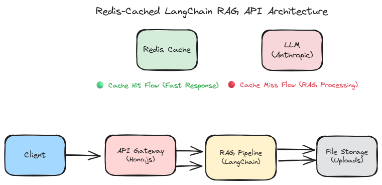

# 🚀 Hybrid RAG API with LangChain, Qdrant & Redis Caching

A Node.js API that implements **Hybrid Retrieval-Augmented Generation (RAG)** using LangChain, combining **BM25 keyword search** and **Qdrant vector search** for superior document retrieval, powered by Anthropic's Claude model and Redis for intelligent caching.



## ✨ Features

- 📁 File upload and storage with automatic vector indexing
- ✂️ Text chunking and processing (500 chars, 150 overlap)
- 🔀 **Hybrid Retrieval**: Combines BM25 (keyword) + Qdrant (semantic) search
- 🔍 **BM25 Retriever**: Fast keyword-based document search
- 🧠 **Qdrant Vector Store**: Semantic similarity search with cosine distance
- 🤖 **OpenAI Embeddings**: text-embedding-3-small (1536 dimensions)
- 🤖 Anthropic Claude integration for question answering
- 🚀 **Redis caching for improved performance** (24h TTL)
- 📊 **Cache statistics and monitoring**
- 🔄 **Automatic cache invalidation** on file updates
- 🌐 RESTful API endpoints

## 🛠️ Setup

1. **Install dependencies:**

   ```bash
   pnpm install
   ```

2. **Configure environment:**

   ```bash
   pnpm run setup
   ```

   This will create a `.env` file. Update it with your actual API keys.

3. **Set your API keys:**
   Edit the `.env` file and configure:

   ```bash
   # Required: Anthropic API key
   ANTHROPIC_API_KEY=your_anthropic_api_key_here

   # Required: OpenAI API key for embeddings
   OPEN_AI_API_KEY=your_openai_api_key_here
   ```

4. **Configure Redis (optional):**

   ```bash
   # Redis configuration (defaults to localhost:6379)
   REDIS_HOST=localhost
   REDIS_PORT=6379
   REDIS_PASSWORD=your_redis_password_here
   ```

5. **Configure Qdrant (optional):**

   ```bash
   # Qdrant vector database configuration (defaults to localhost:6333)
   QDRANT_HOST=localhost
   QDRANT_PORT=6333
   QDRANT_COLLECTION_NAME=documents
   ```

6. **Configure Hybrid Search (optional):**
   ```bash
   # Hybrid search weights (defaults to 0.5 each)
   HYBRID_SEARCH_BM25_WEIGHT=0.5
   HYBRID_SEARCH_VECTOR_WEIGHT=0.5
   HYBRID_SEARCH_TOP_K=8
   ```

## 🚀 Usage

### Development

```bash
pnpm run dev
```

### Production

```bash
pnpm run build
pnpm start
```

### Test RAG Chain

```bash
pnpm test
```

## 📡 API Endpoints

### Upload File

- **POST** `/upload-file`
- Upload a `.txt` file for processing
- Automatically clears any existing cache for the file

### Ask Question

- **POST** `/ask-question`
- Body: `{ "filename": "filename.txt", "question": "Your question here" }`
- **Smart caching**: Returns cached answers instantly if available
- **Cache miss**: Processes the question and caches the result

### Cache Management

- **GET** `/cache-stats`
- Returns Redis cache statistics including total keys and memory usage

- **DELETE** `/delete-cache`
- Body: `{ "filename": "filename.txt" }`
- Clears all cached Q&A pairs for a specific file

## 🔧 Redis Implementation

### Features

- **Intelligent Caching**: Questions and answers are cached with 24-hour TTL
- **Smart Key Generation**: Uses question hash + filename for unique cache keys
- **Automatic Invalidation**: Cache is cleared when files are re-uploaded
- **Memory Management**: Configurable memory limits and LRU eviction
- **Performance Monitoring**: Real-time cache statistics and memory usage

### Cache Strategy

```typescript
// Cache key format: qa:{filename}:{questionHash}
// TTL: 24 hours (configurable)
// Memory policy: LRU eviction with 256MB limit
```

### Redis Operations

- **Set**: Cache Q&A pairs with expiration
- **Get**: Retrieve cached answers
- **Exists**: Check if answer is cached
- **Delete**: Remove specific cache entries
- **Clear File Cache**: Remove all cached items for a file
- **Statistics**: Monitor cache performance and memory usage

## 📁 File Structure

- `src/anthropic/index.ts` - Anthropic RAG chain implementation
- `src/routes/langchain-router.ts` - API route handlers with Redis integration
- `src/lib/hybrid-retriever.ts` - Hybrid retrieval combining BM25 + Vector search
- `src/lib/qdrant.ts` - Qdrant vector database service
- `src/lib/embeddings.ts` - OpenAI embeddings service
- `src/lib/redis.ts` - Redis caching implementation
- `src/lib/storage.ts` - File storage utilities
- `src/constants.ts` - Configuration including Redis, Qdrant, and hybrid search settings
- `uploads/` - Directory for uploaded files

## 🔄 How It Works

### File Upload Flow

1. **📤 File Upload**: Text files are uploaded and stored
2. **🧹 Cache Invalidation**: Existing cache and vectors for the file are cleared
3. **✂️ Text Processing**: Files are split into chunks (500 chars, 150 overlap) using RecursiveCharacterTextSplitter
4. **🧠 Embedding Generation**: Each chunk is converted to vectors using OpenAI embeddings (1536 dimensions)
5. **💾 Vector Storage**: Embeddings are stored in Qdrant with metadata (filename, chunk_index, page_content)
6. **✅ Ready for Retrieval**: File is now indexed and ready for hybrid search

### Question Answering Flow

1. **❓ Question Received**: Client sends question with filename
2. **🔍 Cache Check**: Redis cache is checked for existing answer
3. **⚡ Cache Hit**: If found, return cached answer immediately (1-5ms)
4. **🔄 Cache Miss**: Process through hybrid RAG pipeline:
   - **Parallel Retrieval**:
     - **Keyword Path**: BM25 Retriever searches in-memory documents
     - **Semantic Path**: Query → OpenAI Embeddings → Qdrant vector search
   - **Hybrid Merging**: Results are normalized, weighted (0.5 BM25 + 0.5 Vector), and merged
   - **Top K Selection**: Best 8 documents selected based on combined scores
5. **🤖 Generation**: Anthropic Claude generates answer from retrieved context
6. **💾 Caching**: Q&A pair is cached in Redis with 24-hour TTL
7. **📤 Response**: The answer is returned to the user

### Hybrid Retrieval Architecture

```
Question → Check Redis Cache → Cache Hit? → Return Cached Answer (1-5ms)
                ↓
            Cache Miss
                ↓
        ┌───────────────────┐
        │  Hybrid Retriever │
        └─────────┬─────────┘
                  │
        ┌─────────┴─────────┐
        │                   │
    BM25 Search      Vector Search
    (Keyword)        (Semantic)
        │                   │
        │            Query → Embeddings
        │                   │
        │            Qdrant Vector DB
        │                   │
        └─────────┬─────────┘
                  │
        Merge & Rank Results
        (Normalize + Weight)
                  │
        Top K Documents
                  │
        └─────────→ RAG Pipeline → LLM → Cache → Response
```

### Hybrid Search Benefits

- **🎯 Better Accuracy**: Combines exact keyword matching (BM25) with semantic understanding (vectors)
- **⚡ Fast Retrieval**: Parallel execution of both search methods
- **🔧 Configurable Weights**: Adjust BM25/Vector weights (default: 0.5 each)
- **📊 Score Normalization**: Ensures fair combination of different scoring systems
- **🎨 Best of Both Worlds**: Catches both keyword matches and conceptual similarities

## 🐳 Docker Setup

### Prerequisites

- Docker installed on your system
- Docker Compose installed on your system

### Quick Start with Docker

1. **Clone and navigate to the project:**

   ```bash
   git clone https://github.com/bruxx-6243/langchain-rag-node-api.git

   cd langchain-rag-node-api
   ```

2. **Create environment file:**

   ```bash
   # Copy the example environment file
   cp .env.example .env

   # Edit .env and add your API keys
   ANTHROPIC_API_KEY=your_actual_api_key_here
   OPEN_AI_API_KEY=your_openai_api_key_here

   # Optional: Configure Redis
   REDIS_HOST=redis
   REDIS_PORT=6379
   REDIS_PASSWORD=your_redis_password

   # Optional: Configure Qdrant
   QDRANT_HOST=qdrant
   QDRANT_PORT=6333
   QDRANT_COLLECTION_NAME=documents
   ```

3. **Launch the application:**

   ```bash
   # Production mode
   docker-compose up --build

   # Or development mode with hot reloading
   docker-compose -f docker-compose.dev.yml up --build
   ```

4. **Access your API:**
   - **Production**: http://localhost:4000/api/
   - **Development**: http://localhost:4000/api/
   - **Redis**: localhost:6379
   - **Qdrant**: http://localhost:6333 (dashboard: http://localhost:6333/dashboard)

### Service Containers

#### Redis Container

- **Image**: `redis:7-alpine` (lightweight and secure)
- **Memory Limit**: 256MB with LRU eviction policy
- **Persistence**: AOF (Append-Only File) enabled
- **Health Checks**: Automatic health monitoring
- **Port**: 6379 (standard Redis port)

#### Qdrant Container

- **Image**: `qdrant/qdrant:latest` (vector database)
- **Storage**: Persistent vector storage
- **Health Checks**: Automatic health monitoring
- **Port**: 6333 (HTTP API), 6334 (gRPC)
- **Dashboard**: Web UI available at http://localhost:6333/dashboard

### Docker Commands

#### **Start Services:**

```bash
# Build and start production
docker-compose up --build

# Build and start development (with hot reloading)
docker-compose -f docker-compose.dev.yml up --build

# Run in detached mode
docker-compose up --build -d
```

#### **Stop Services:**

```bash
# Stop all services
docker-compose down

# Stop and remove volumes
docker-compose down -v
```

#### **View Logs:**

```bash
# View logs for all services
docker-compose logs -f

# View logs for specific service
docker-compose logs -f langchain-rag-api
docker-compose logs -f redis
```

#### **Service Management:**

```bash
# Redis CLI
docker exec -it langchain-redis redis-cli
docker exec -it langchain-redis redis-cli monitor
docker exec -it langchain-redis redis-cli info

# Qdrant Management
# Access Qdrant dashboard: http://localhost:6333/dashboard
# Check Qdrant collections via API
curl http://localhost:6333/collections
```

#### **Cleanup:**

```bash
# Remove all containers, images, and volumes
docker-compose down --rmi all --volumes --remove-orphans

# Clean up Docker system
docker system prune -a
```

### File Storage & Cleanup

The application automatically manages file storage with a 2GB limit:

- **Uploads Directory**: `./uploads/` (persistent across container restarts)
- **Redis Data**: Persistent Redis data with AOF logging
- **Automatic Cleanup**: Oldest files are deleted when storage exceeds 2GB
- **Cache Invalidation**: Automatic cache clearing when files are re-uploaded
- **Manual Cleanup**: Run cleanup manually when needed

#### **Run Cleanup:**

```bash
# Using npm script
pnpm run cleanup

# Using Docker Compose
docker-compose --profile cleanup run --rm uploads-cleanup

# Using shell script
./run-cleanup.sh
```

### Docker Compose Files

- **`docker-compose.yml`**: Production configuration with Redis
- **`docker-compose.dev.yml`**: Development configuration with Redis and hot reloading
- **`Dockerfile`**: Production multi-stage build
- **`Dockerfile.dev`**: Development build with source mounting

### Volume Mounts

- **`./uploads:/app/uploads`**: Persistent file storage
- **`./src:/app/src`**: Source code mounting (development only)
- **`./.env:/app/.env`**: Environment variables
- **`redis_data:/data`**: Redis persistent data storage
- **`qdrant_storage:/qdrant/storage`**: Qdrant persistent vector storage

## 🚨 Troubleshooting

### Redis Issues

- ⚠️ **Connection Errors**: Ensure Redis container is running and accessible
- 🔌 **Port Conflicts**: Check if port 6379 is available
- 🔑 **Authentication**: Verify Redis password configuration if using authentication
- 💾 **Memory Issues**: Monitor Redis memory usage with `/cache-stats` endpoint

### General Issues

- ⚠️ Ensure your `.env` file contains valid `ANTHROPIC_API_KEY` and `OPEN_AI_API_KEY`
- 📝 Check that uploaded files are valid `.txt` files
- 📁 Verify the `uploads/` directory exists and is writable
- 🐳 If Docker issues occur, try `docker system prune -a` to clean up
- 🔄 For port conflicts, check if ports 4000, 6379, and 6333 are available
- 🧠 **Qdrant Connection**: Ensure Qdrant container is running and accessible
- 🔍 **Embedding Issues**: Verify OpenAI API key is valid and has embedding access

### Performance Optimization

- **Cache Hit Rate**: Monitor with `/cache-stats` endpoint
- **Memory Usage**: Redis is configured with 256MB limit and LRU eviction
- **TTL Management**: Cache entries expire after 24 hours automatically
- **File Uploads**: Large files trigger automatic cache and vector invalidation
- **Hybrid Search**: Parallel execution of BM25 and vector search for optimal speed
- **Vector Indexing**: Qdrant uses efficient cosine similarity search with filtering
- **Embedding Caching**: Consider caching embeddings for frequently accessed documents
- **Top K Tuning**: Adjust `HYBRID_SEARCH_TOP_K` based on your use case (default: 8)

## 📊 Monitoring & Analytics

### Cache Statistics

- **Total Keys**: Number of cached Q&A pairs
- **Memory Usage**: Redis memory consumption
- **Cache Hit Rate**: Monitor via application logs
- **Performance Metrics**: Response times with and without cache

### Vector Database Statistics

- **Collection Info**: Monitor Qdrant collections via `/api/cache-stats` or Qdrant dashboard
- **Vector Count**: Track number of indexed document chunks
- **Search Performance**: Monitor hybrid search response times
- **Storage Usage**: Check Qdrant storage consumption

### Health Checks

- **Redis Health**: Automatic health monitoring every 30 seconds
- **API Health**: Endpoint availability monitoring
- **Container Health**: Docker health check integration
